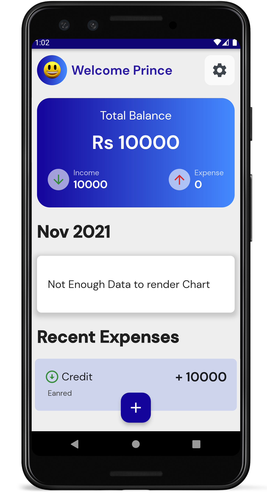

# `Expense App`

This app helps you with managing Income and Expense. It is coded in flutter, dart hive. TBH I want to code the same app in Flutter , React and Jetpack Compose to see the difference and get some experience, but let's see what Happens. :) 🤠🤗

```
Note : This is right now an active project where I 
am making changes, If you want the same version as 
in Youtube Tutorial Version 1 : Download the zip 
file the same name.
```

## Making Changes for V2
    - Removed Gradient Code
    - Adding Date and Delete Option in each Expense Tile

# `Screenshots`





# `Credits`

```
## Face Emoji : http://clipart-library.com/images_k/transparent-happy-emoji/transparent-happy-emoji-15.png

## Icon : <div>Icons made by <a href="https://www.flaticon.com/authors/gowi" title="GOWI">GOWI</a> from <a href="https://www.flaticon.com/" title="Flaticon">www.flaticon.com</a></div>

## App Icon : <a target="_blank" href="https://icons8.com/icon/pBgBsoOMl5LD/money">Money</a> icon by <a target="_blank" href="https://icons8.com">Icons8</a>
```

## `Features`

<input type="checkbox" /> Fix year when month is december

<input type="checkbox" /> Add Montly limit and show How much has been spent Yet.

<input type="checkbox" /> Show Charts of Money Spent on each day
    
<input type="checkbox" checked /> Add Expense and Income

<input type="checkbox" checked /> Show Total Balance

<input type="checkbox" /> Option to Extract data or Server ?

<input type="checkbox" /> Option to add Bio Auth

<input type="checkbox" /> Chart plot points is based on when user enters data , not on expense date , so chart might have bars coming back and moving front

```
## `Data`

    - amount
    - type [ "Income", "Expense" ]
    - date
    - note ( 256 )
```
