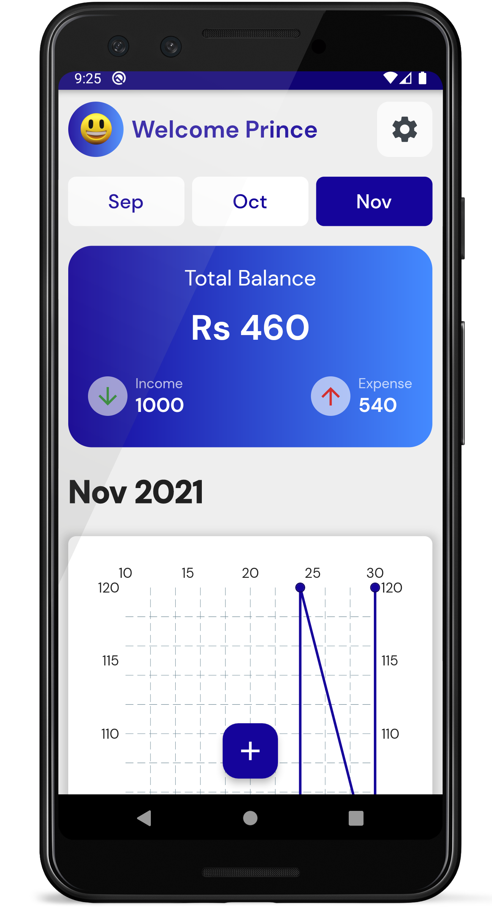
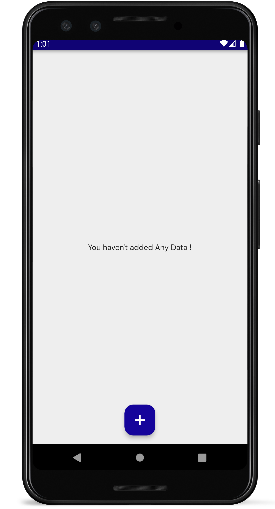
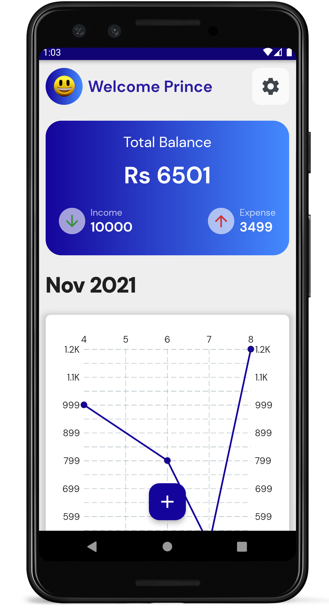
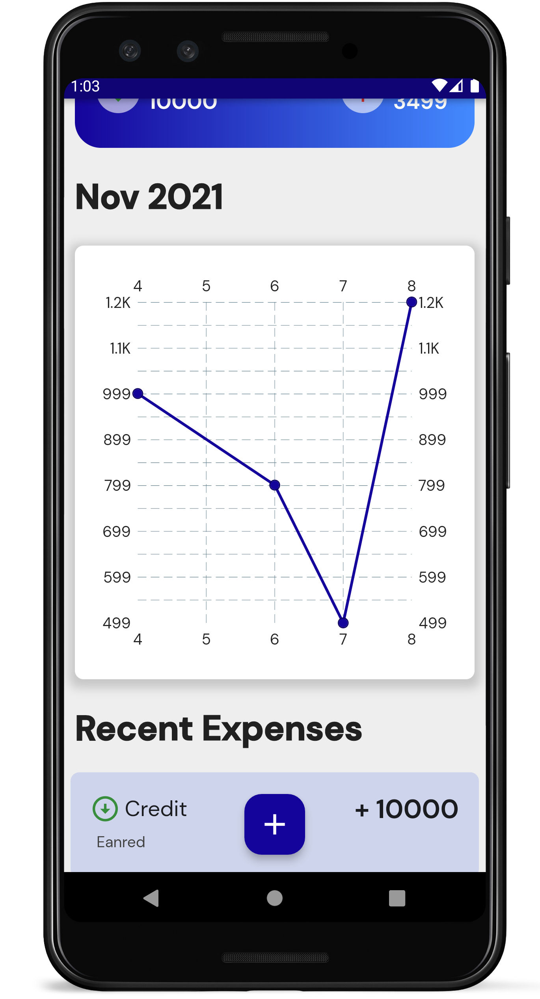
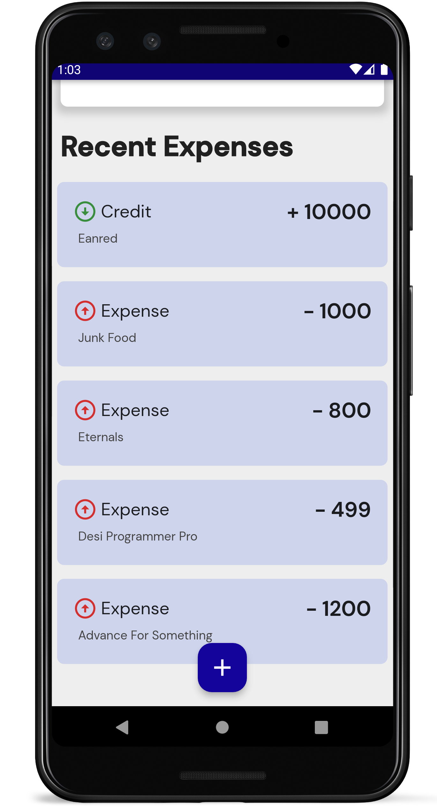

# `Expense App`

This app helps you with managing Income and Expense. It is coded in flutter, dart hive. TBH I want to code the same app in Flutter , React and Jetpack Compose to see the difference and get some experience, but let's see what Happens. :) 🤠🤗

```
Will try and update this to use different (state management) Libraries.
```

## Making Changes for V2

    - Removed Gradient Code
    - Adding Date and Delete Option in each Expense Tile

# `Screenshots`













# `Credits`

```
## Face Emoji : http://clipart-library.com/images_k/transparent-happy-emoji/transparent-happy-emoji-15.png

## Icon : <div>Icons made by <a href="https://www.flaticon.com/authors/gowi" title="GOWI">GOWI</a> from <a href="https://www.flaticon.com/" title="Flaticon">www.flaticon.com</a></div>

## App Icon : <a target="_blank" href="https://icons8.com/icon/pBgBsoOMl5LD/money">Money</a> icon by <a target="_blank" href="https://icons8.com">Icons8</a>
```

## `BUG`

When month is 12, Need to switch years too, to reflect changes. ( Showing transaction of nearby months )
Bar chart skips date with single unit of expense.
Multiple setState cause anomalies, will use something else.

## `Features`

`❌` Fix year when month is December.

`❌` Add Monthly limit and show How much has been spent Yet.

`❌` Show Charts of Money Spent on each day

`✔️` Add Expense and Income

`✔️` Show Total Balance

`❌` Option to Extract data or Server ?

`✔️` Option to add Bio Auth

`✔️` Add Provider ( possibly in another branch )

`✔️` Add Models For Data

`✔️` Chart plot points is based on when user enters data , not on expense date , so chart might have bars coming back and moving front

```
## `Data`

    - amount
    - type [ "Income", "Expense" ]
    - date
    - note ( 256 )
```
